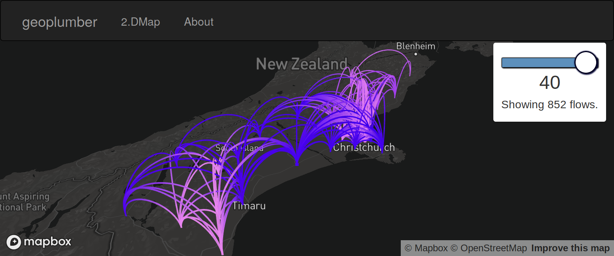

---
output:
  blogdown::html_page:
    toc: true
title: "About"
date: ""
---

## Why a geospatial transport theme?

The University of Leeds is one of the only places in the world where you can find expertise in cutting-edge methods for geospatial analysis alongside world leading transport research.
[The School of Geography](https://environment.leeds.ac.uk/geography) is ranked in the top 20 geography departments worldwide; while [ITS Leeds](https://environment.leeds.ac.uk/transport) is rated in the top 10.

Finding both subjects in the same university is rare, finding both subjects in the same faculty is unique.
When these strengths are combined, amazing things are possible.
This theme seeks to provide the go-to point for quantitative and computational transport geography research worldwide.

```{r, out.width="100%", echo=FALSE}

```

*Illustration of simulated flows between origins and destinations in an interactive 2.5D map using Uber's deck.gl software*

<br/>
<br/>
<br/>

## Aims

The aim is to build world leading geographic transport research and better communicate our expertise to the outside world including to:

- Students deciding where to study
- Industry partners deciding which academics to partner with
- Government looking for advice on where to go with geographic data
- Potential academic partners

## Activities

Many of the activities are already on-going but will be better represented within ITS.
These activities include:

- GIS development roles, building student resources
- Developing new software for processing geographic datasets, such as **opentripplanner** (led by Malcolm Morgan), **stplanr** (led by Robin Lovelace) **openair** (Karl Ropkins and James Tate), and other software projects 
- Geographic teaching in modules, which is already strong, but is in need of being joined-up for students and lecturers, enabling easy access to quality teaching material
- CPD offerings focussing on geographic data (e.g. Highways England course with 150% returns)

A range of additional activities could be undertaken, including:

- Regular (e.g. quarterly) invited seminars
- Provision of services to students (e.g. routing engine with API key like Google Distance Matrix)
- Additional CPD offerings

<br/>
<br/>
<br/>
<br/>

## Questions

How can you (staff from ITS) contribute to the theme?

- Communicate geospatial work going on in your research project

What can the theme do for you?

- Be a platform for research and teaching collaborations on geographic data
